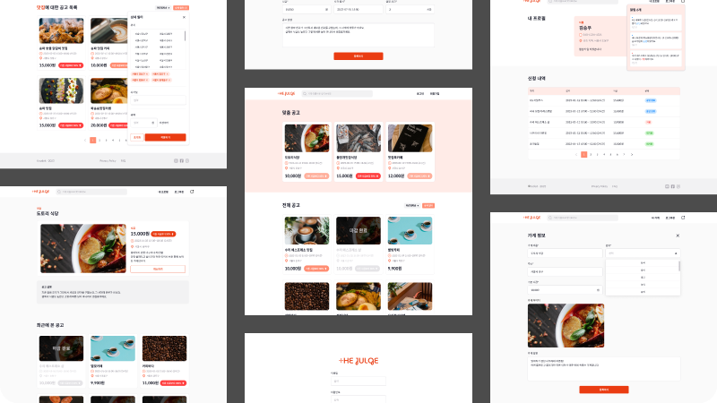

<h1 align="center">
 
</h1>
The-Julge is a service that helps businesses quickly find part-time workers by offering higher hourly wages for urgent job positions.
 
 

- Development Period: Jan 25, 2024 ~ Feb 13, 2024 (5-member Team Project)
   
   

 

## Tech Stack

Next.js, TypeScript, SCSS, Git & GitHub, Vercel

## Key Features

- User authentication (login/signup)
- Different features based on user types (employer/employee)
- Job posting filters
- Job listing with pagination/infinite scroll
- Real-time notifications

## Team Members

- Jisun Park (Frontend)
- Mijin Kim (Frontend)
- Youngeun Kim (Frontend)
- Hyunsoo Kim (Frontend)
- Chaeyeon Hwang (Frontend)

## 🌏 Languages

- [한국어 버전(Korean)](./README.ko.md)
- [English Version](./README.md)
