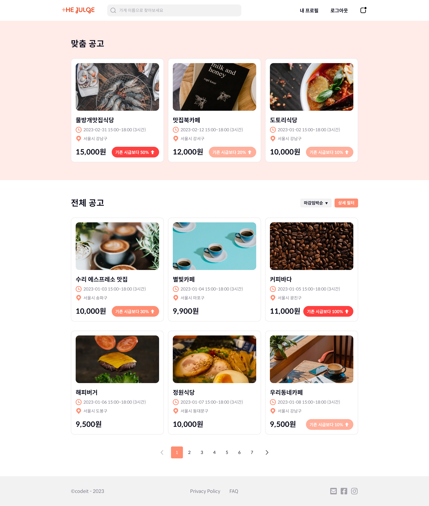

<h1 align="center">
 
</h1>
The-Julge(더줄게)는 급하게 일손이 필요한 자리에 더 많은 시급을 제공하여 아르바이트생을 빠르게 구할 수 있는 서비스입니다.   
 
 

- 개발 기간: 2024. 1. 25. ~ 2024. 2. 13. (5인 팀 프로젝트)
   
   

 

## 기술 스택

Next.js, TypeScript, SCSS, Git & GitHub, Vercel

## 주요 기능

로그인 및 회원가입, 유저 타입에 따라 다른 기능 구현, 공고 필터링, 페이지네이션/무한스크롤을 통한 공고 리스트, 알림 기능

## 멤버

- 박지선 (Frontend)
- 김미진 (Frontend)
- 김영은 (Frontend)
- 김현수 (Frontend)
- 황채연 (Frontend)
